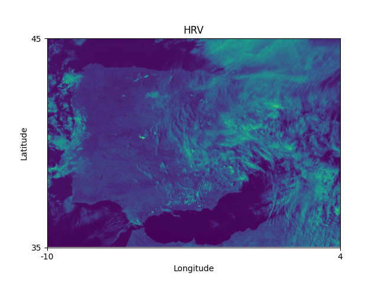
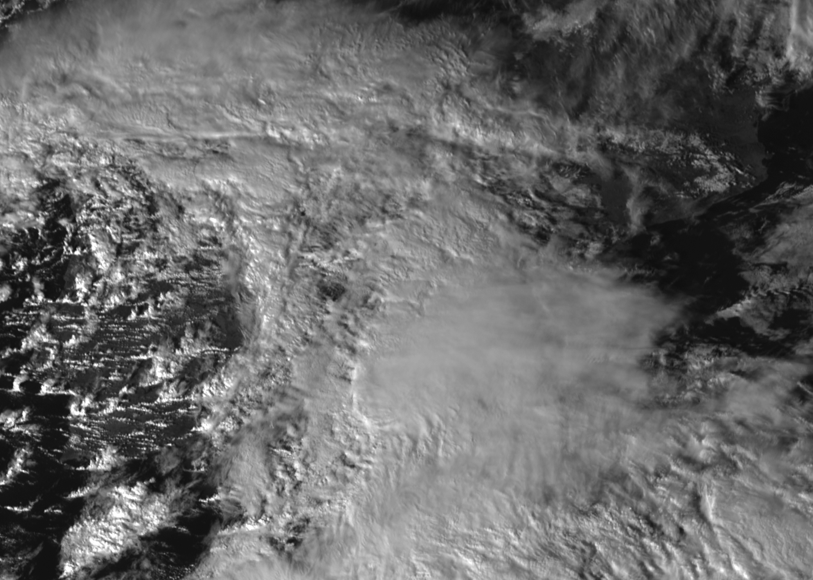

# EUMETSAT ELT pipeline

The files with ".nat" extension are the native file format of the Meteosat Geostationary satellites. In order to obtain the newest Meteosat images, I found a script by Mr. [Darius A. Görgen](https://www.dariusgoergen.com/contents/blog/2020-06-14-nat2tif/index.html) and tweaked it to automate the process from extracion to transformation.

# Dependencies
The offline version of this script requires **pandas, numpy, osgeo (GDAL), satpy and pyresample** libraries to function. The online version also requires **eumdac** library and obtaining its API credentials. When using Ubuntu 20.04LTS, the GDAL library can be tricky to install correctly, even when using virtual environment tools. Luckily, GitHub user [nvogtvincent](https://github.com/nvogtvincent) provided an [answer](https://github.com/ContinuumIO/anaconda-issues/issues/10351#issuecomment-976661610) that did it for me.

# Recipe format
The script will transform the data following the parameter specifications written in the eumetsat_recipe.txt file. The current version script will fail if the parameters do not follow some coherence guidelines:
* Color parameter will only accept **RGB** or **mono** as inputs. If **RGB** is specified, the script will ignore all pyresample and OpenCV parameters (calibration, dtype, radius, epsilon, nodata, out_type, brightness and contrast) and can take composite datasets, but will only show satpy resampled areas.
* Calibration admits **radiance** or **reflectance** options.
* Area definition for image projection. Available areas are found in satpy's areas.yaml file. This field can be set to **area_def**, that uses a custom area resampling module in the script. I live in Spain, so the default custom area is set to the Iberian peninsula.
* Dataset can be any of the available for the color chosen. For **mono** it takes the specific wavelenght name and for **RGB** it can take any of the composite options. Available options can be checked with satpy's Scene from a Python shell:
```
  from satpy import Scene
  file = 'path/to/your/file.nat'
  scn = Scene(filenames = {'seviri_l1b_native': [file]})
  scn.all_dataset_names(reader_name='seviri_l1b_native',composites=True)
```
* Reader chooses how to read the file. For all the MSG data, the **seviri_l1b_native** reader is the only one tested.
* Label will only affect the output name but not the image processing.
* Dtype, Radius, Epsilon and Nodata are used in the pyresample resampling module. It works best fixing the values to **float32**, **16000**, **.5** and **-3.4E+38** respectively. More info in Mr. Görgen's [website](https://www.dariusgoergen.com/contents/blog/2020-06-14-nat2tif/index.html).
* Out Type specifies the image processing library used in the image creation, as long as it is monochromatic. It can take **tif**, **cv2** or **plt** for GTiff, OpenCV or MatPlotLib respectively. The colored options are always set to OpenCV, that outputs a **.png** file.
* Brightness and Contrast are used by OpenCV to modify said parameters during its processing.
* Start Time and End Time set the time range for extracting and processing data. If the Start Time is set to **Recent**, the script will automatically get the latest images in a 20-minute range. **Note:** Sometimes the EUMDAC API fails to update the most recent images. It has been happening lately, so I updated the script in order to warn the user that no files are to be found in the selected time range. I'm trying to find out the reason for this inconvenience at the moment.

# Output
Here are some example files using different output types.


Made with MatPlotLib


Made with OpenCV


Made with SatPy
